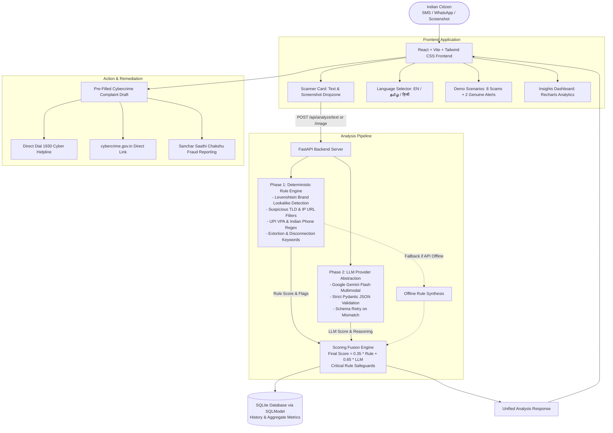

# 🛡️ Scam Shield (स्कैम शील्ड / ஸ்கேம் ஷீல்ட்)
### AI-Powered Multi-Modal Scam Detector & Cybercrime Assistant for Indian Citizens

[](https://cybercrime.gov.in)
[](https://fastapi.tiangolo.com)
[](https://vitejs.dev)
[](https://aistudio.google.com)
[](LICENSE)

---

## 📌 Problem Statement

Indian citizens lose **thousands of crores annually** to sophisticated social engineering, SMS, WhatsApp, and UPI scams. Ordinary users, elderly citizens, and small business owners are inundated with deceptive messages every day:
- **Bank KYC Suspensions**: Urgent SMS threats claiming SBI YONO, HDFC, or ICICI accounts will be permanently blocked unless a spoofed link is clicked.
- **"Digital Arrest" Extortion**: Criminal syndicates impersonating the CBI, Crime Branch, or Narcotics Bureau on Skype/WhatsApp video calls, falsely claiming drugs were intercepted in parcels registered under the victim's Aadhaar.
- **Electricity Bill Disconnections**: Panic-inducing messages threatening power shutoff at 9:30 PM tonight unless an unauthorized mobile number is phoned.
- **Work-From-Home / Telegram Tasks**: Luring victims with Rs. 3,000–5,000/day for liking YouTube videos before draining their savings in prepaid cryptocurrency Ponzi schemes.
- **UPI "Reverse Cashback" Fraud**: Trick collect requests claiming user must enter their UPI PIN to "receive" refunds or bonus credits.
- **Predatory Loan APKs**: Malicious Android applications that bypass app stores to harvest phonebooks and photos for blackmail.

Ordinary citizens struggle to discern authentic notifications from malicious scams. Existing tools are either purely technical or offer generic English advice that is inaccessible to vernacular-speaking users.

**Scam Shield** solves this with an instant, multi-modal scanner: paste suspicious text or upload a chat screenshot, receive a transparent risk score and plain-language explanation in **English, தமிழ் (Tamil), or हिन्दी (Hindi)**, and generate a pre-filled complaint formatted for **National Cyber Crime Reporting Portal (1930 / cybercrime.gov.in)** and **Sanchar Saathi (Chakshu)**.

---

## 🚀 Key Features & Innovation

1. **Dual-Engine Fusion Architecture**:
   - **Pre-LLM Deterministic Rule Engine**: Runs first to extract Indian phone numbers, UPI VPAs, URLs, and currency amounts. Detects brand lookalikes using Levenshtein distance (`sbi`, `hdfc`, `paytm`, `indiapost`, `tneb`), suspicious TLDs (`.xyz`, `.top`, `.loan`, `.apk`), IP-based links, and Indian extortion keywords.
   - **Contextual Gemini AI Reasoning**: Analyzes linguistic nuance, deceptive tone, and psychological pressure. Enforces strict Pydantic JSON schema with automatic single-turn retry and graceful fallback if the LLM is unreachable.
2. **Multi-Modal Screenshot Vision**:
   - Direct image upload (PNG/JPG/WEBP). Gemini Flash Vision transcribes the chat or SMS screen and feeds the transcribed evidence directly into the dual-engine pipeline.
3. **Multilingual Plain-Language Guidance**:
   - Delivers actionable advice in **English**, **தமிழ் (Tamil)**, and **हिन्दी (Hindi)**. Explains *why* the message is dangerous and provides an ordered 3-step action plan.
4. **Pre-Filled Cybercrime Complaint Generator**:
   - Automatically drafts a formal complaint with incident date, suspect identifiers, extracted bank/UPI details, and narrative, ready for submission to `cybercrime.gov.in`.
   - Direct action triggers: **Call 1930 Helpline** (`tel:1930`), **Report at cybercrime.gov.in**, and **Forward to DoT Chakshu**.
5. **Interactive Insights & Threat Intelligence**:
   - `/insights` dashboard powered by Recharts visualizing category breakdowns, verdict distributions, and field threat briefings on active Indian scam vectors.
6. **Built-in Demo Mode**:
   - "Try an Example" modal containing **8 realistic Indian scam scenarios** plus **2 genuine messages** (Bank OTP from `VK-HDFCBK` and Amazon Delivery alert) to demonstrate zero/low false-positive accuracy.
7. **Privacy-Preserving**:
   - Local SQLite storage with a "Do not save this scan" privacy toggle for sensitive communications.

---

## 📐 Architecture Diagram



---

## 🧮 Weighted Scoring Formula

Scam Shield balances deterministic heuristics with LLM contextual reasoning using the following formula:

$$\text{Final Risk Score} = \text{round}(0.35 \times \text{Rule Score} + 0.65 \times \text{LLM Score})$$

### Classification Thresholds:
- **SCAM (Red)**: $\text{Final Score} \ge 70$
- **SUSPICIOUS (Amber)**: $35 \le \text{Final Score} < 70$
- **LIKELY SAFE (Green)**: $\text{Final Score} < 35$

### Critical Threat Overrides:
To eliminate false negatives on severe extortion and financial theft vectors, the system applies safety guards:
- If a **Critical Rule** triggers (such as `DIGITAL_ARREST_EXTORTION`, `UPI_COLLECT_REVERSE_SCAM`, `OTP_CREDENTIAL_HARVEST`, `URL_APK_DOWNLOAD`, or `UTILITY_ELECTRICITY_DISCONNECTION`), the final score is guaranteed a minimum floor ($\ge 55$), ensuring it is never marked as `LIKELY_SAFE`.
- If the Gemini LLM is unavailable or unconfigured, the system automatically falls back to: $\text{Final Score} = \text{Rule Score}$.

---

## 💻 Tech Stack

| Layer | Technologies |
|---|---|
| **Frontend** | React 19, Vite, Tailwind CSS, Lucide Icons, Recharts, Canvas-Confetti |
| **Backend** | Python 3.11+, FastAPI, Uvicorn, SlowAPI (Rate Limiting) |
| **Artificial Intelligence** | Google Gemini API (`gemini-3.8-flash` via `google-genai` SDK) |
| **Database** | SQLite via SQLModel (SQLAlchemy 2.0 core) |
| **Validation** | Pydantic v2 (Strict Schema Validation) |
| **Testing** | Pytest (25 test cases covering rules & mocked API flows) |
| **Deployment** | Render (`render.yaml` for Backend), Vercel (`vercel.json` for Frontend) |

---

## ⚙️ Setup & Installation

### Prerequisites
- Python 3.11+
- Node.js 18+ and npm
- (Optional) Google Gemini API Key from [Google AI Studio](https://aistudio.google.com/)

### 1. Clone the Repository
```bash
git clone https://github.com/your-username/scam-shield.git
cd scam-shield
```

### 2. Backend Setup
```bash
cd backend

# Create and activate virtual environment
python -m venv .venv
# On Windows:
.\.venv\Scripts\activate
# On Linux/macOS:
# source .venv/bin/activate

# Install dependencies
pip install -r requirements.txt

# Configure environment variables
cp .env.example .env
# Edit .env and paste your GEMINI_API_KEY (optional, fallback works offline!)

# Run tests
pytest backend/tests -v

# Start FastAPI server
uvicorn backend.main:app --reload --port 8000
```
Backend will be live at `http://localhost:8000`. Swagger API docs are available at `http://localhost:8000/docs`.

### 3. Frontend Setup
```bash
cd ../frontend

# Install dependencies
npm install

# Start Vite development server
npm run dev
```
Frontend will be live at `http://localhost:5173`.

---

## 🧪 Testing & Verification

The test suite includes **25 automated tests** validating:
- Levenshtein distance calculations and typo-squatting (`sbii.com`, `hdfcbankk.com`).
- Suspicious TLDs (`.xyz`, `.top`, `.loan`, `.apk`), IP URLs, and URL shorteners.
- High-impact Indian scam vectors (KYC bank block, electricity bill, digital arrest, KBC lottery, Telegram task, FedEx customs, UPI collect request).
- Genuine message classifications (Bank OTP with TRAI header `VK-HDFCBK` and Amazon delivery alert) with low false positives.
- Full API integration tests mocking the LLM provider for success, single-turn schema retry, and fallback.

To run the test suite:
```bash
pytest backend/tests -v
```

---

## 📸 Screenshots & Demo Walkthrough

### 1. Scanner & Real-Time Risk Gauge
- Clean, mobile-first dark interface with text and screenshot upload tabs.
- Live animated circular risk meter (0–100) with confidence breakdown.

### 2. Multilingual Output (English, Tamil, Hindi)
- Seamless one-click language toggle translating explanations and action steps into Tamil (தமிழ்) and Hindi (हिन्दी).

### 3. Cybercrime Complaint Helper
- Generates pre-formatted complaint text ready for submission to `cybercrime.gov.in` and quick-dial links for `1930`.

### 4. Threat Intelligence Insights Dashboard
- Visualizes scam trends across India with interactive Recharts diagrams.

---

## 🔗 Project Links

- **Live Demo**: `https://scam-shield.vercel.app` *(Placeholder / Configure after deploy)*
- **Demo Video Walkthrough**: `https://youtu.be/scam-shield-demo` *(Placeholder)*
- **API Endpoint Documentation**: `http://localhost:8000/docs`

---

## 🔮 Future Scope & Roadmap

1. **Browser Extension (Chrome / Brave)**:
   - Real-time scanning of web pages, netbanking login portals, and WhatsApp Web chat bubbles using Manifest V3.
2. **WhatsApp Bot & Telegram Bot**:
   - Allow users to forward suspicious SMS or audio voice notes directly to a WhatsApp bot number for instant analysis.
3. **Crowd-Sourced Indian Scam Database**:
   - Community-driven verified repository of fraudulent UPI VPAs and mobile numbers linked with Sanchar Saathi.
4. **Voice Call Audio Analysis**:
   - Integration with Gemini Live API for real-time scam detection on live calls.

---

## 🛡️ Hackathon Submission Details
- **Track**: Digital Safety & Cybersecurity
- **Developer**: Solo Hackathon Entry
- **Target Audience**: Indian Citizens, Senior Citizens, Vernacular Language Users
